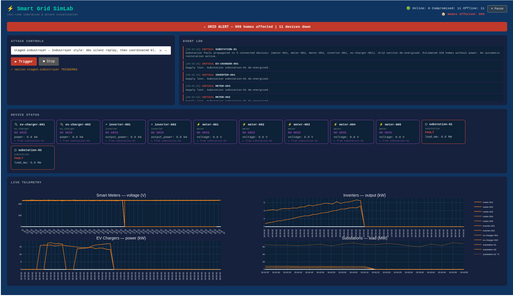

# Smart Grid SimLab

**This repository has moved.** Development continues at
[codeberg.org/tymyrddin/smart-grid-sim](https://codeberg.org/tymyrddin/smart-grid-sim).
This GitHub copy is archived and will not be updated.



A cyber-attack on a substation stays an abstraction until the lights go out. This runs a small
synthetic grid, turns an attacker loose on it, and puts the result on one screen: meters lying about
their readings, a substation tripping, the count of homes without power climbing.

It is for the moment a room of non-specialists has to understand an OT/ICS threat, a security
briefing, an internal demo, the board that signs off the budget. The incidents behind each attack
are real. The grid is not. Telemetry is synthetic, the effects are injected locally, and nothing
real touches the wire. Not a red team platform, not a CTF.

## On screen

A handful of devices, smart meters, solar inverters, EV chargers and substations, tick along with
live readings. Pick an attack from the dropdown and trigger it. The dashboard reacts the way the
real grid would: a spoofed meter climbs off its own chart, a faulted substation drags its feeders
dark, alarms scroll past, and a counter tallies the homes that just went without power.

Nobody watching has to read a packet capture to follow it. That is the whole idea.

## The attacks

The basics are the building blocks: faking a meter's readings, forcing a device offline, spiking
demand, dragging grid frequency out of its safe band, tripping a substation into a cascade, writing
straight to a control register, and replaying stale data so the operator's screen looks calm while
the grid moves underneath it.

The named scenarios each replay something that actually happened. Hover any entry in the dashboard
for the story behind it.

| Scenario                     | Based on                                                          |
|------------------------------|-------------------------------------------------------------------|
| Coordinated blackout         | Ukraine, 2015. Sandworm cut power to 230,000 people               |
| Staged Industroyer           | Industroyer (2016) and Industroyer2 (2022), Sandworm              |
| Relay bypass                 | Industroyer / Crashoverride disabling protection relays           |
| Safety-system bypass         | Triton / TRISIS, the first malware aimed at safety systems        |
| Wiper                        | Industroyer2 + CaddyWiper, destroying the evidence on the way out |
| Transformer overheating      | Stuxnet, 2010. Slow physical damage while readings look normal    |
| Silent dwell, then blackout  | Volt Typhoon, sitting quietly in US infrastructure                |
| Modbus heating attack        | FrostyGoop, 2024. Heat cut to 600 buildings in Lviv mid-winter    |
| ICS attack framework         | PIPEDREAM / INCONTROLLER, caught before it launched               |
| Ransomware shutdown          | Colonial Pipeline, 2021. The pipeline stopped itself              |
| Out-of-phase breaker cycling | Aurora, 2007. A generator torn apart on camera                    |
| Steel-mill sabotage          | Predatory Sparrow, 2022. A fire at an Iranian mill                |

## Running it

Needs Docker and Python 3.11 or newer.

```bash
# 1. Start MQTT broker
docker compose up -d broker

# 2. Install Python deps
pip install -r requirements.txt

# 3. Start device simulator (background)
python -m simulator.main &

# 4. Start attack engine
python -m attacks.engine &

# 5. Start dashboard
python -m dashboard.app
# → http://localhost:8050
```

The broker runs in Docker; the simulator, engine and dashboard are plain Python processes
talking to it on localhost:1883. `docker compose up --build` will also run the dashboard in a
container, which works fine next to the two local processes.

### Triggering attacks

From the dashboard: pick an attack from the dropdown and click Trigger. Hover over any entry
for the incident it is based on.

Via REST, for scripted demos:

```bash
curl -s -X POST http://localhost:8050/attack/trigger \
  -H "Content-Type: application/json" \
  -d '{"attack_id": "cascade-substation-01"}'
```

Send `{"attack_id": "...", "action": "stop"}` to the same endpoint to stop it.

## A word on safety

The controls have no login, on purpose: triggering attacks is the point. Anyone who can reach the
dashboard or the broker can drive it. Keep it on a trusted local network, and keep the dashboard
(8050) and the broker (1883) off the public internet.

## Under the hood

The full picture lives alongside the code:

- [attacks/attacks.md](attacks/attacks.md), every attack from a red-team and incident angle
- [simulator/devices/devices.md](simulator/devices/devices.md), the devices, how they connect, what the status colours mean
- [dashboard/dashboard.md](dashboard/dashboard.md), what each attack looks like on screen

Attacks and devices are plain YAML in `config/`; edit them and restart. For development, install the
dev tools and run the checks:

```bash
pip install -r requirements-dev.txt
ruff check . && mypy simulator attacks dashboard && pytest
```
